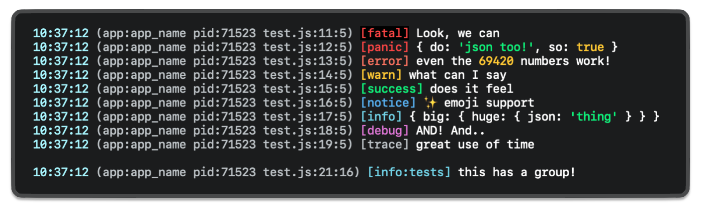

# log4you

A simple library for logging.

<h1 align="left"></h1>

## Usage

```ts
import Logger, { levels, LOG_LEVEL } from 'log4you';

const logger = new Logger({
	enabled: true,
	level: levels[LOG_LEVEL].priority, // based on --level=<name>
	name: 'app_name',
	format: '{brightCyan}%time{reset} {white}(app:%name pid:%pid%file) %color[%level]{reset}',
});
```
